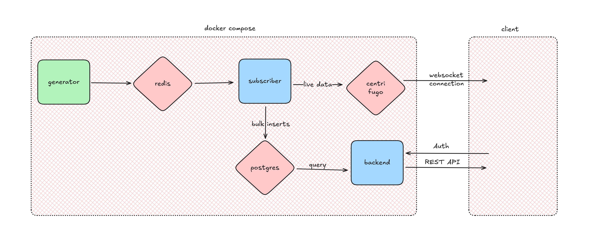

# Baryonic Space Backend Engineer Task

This project implements a real-time and retrospective monitoring system for time-series built with Dockerized microservices. The system simulates stock price streams, stores them for historical analysis, and broadcasts live updates to clients.

The entire project is Dockerized and can be launched with a single command.

## Architecture

This system monitors time-series stock price data both in real-time and historically, leveraging multiple Dockerized components working together:


- **`stock_generator`** – Simulates stock data and publishes to Redis.
- **`redis`** – Acts as the message broker for live stock updates. Holds Pub/Sub channels subscribed by the subscriber service.
- **`subscriber`** – Listens to Redis Pub/Sub channels for live stock updates. Buffers incoming messages in batches, then inserts them into PostgreSQL. Forwards updates in real-time to clients via Centrifugo.
- **`backend`** – FastAPI REST API to query stock price history and averages.
- **`client`** – Frontend that connects to Centrifugo for live updates.
- **`centrifugo(v6.2.3)`** – WebSocket server for broadcasting real-time stock data.
- **`postgres`** – Stores stock price history.
- **`vector(v0.48.0)`** – Collects and stores logs and metrics for observability.
- **`nginx`** – Proxies `/api/`, `/connection/websocket`, and serves static frontend.
- **`grafana`** – Visualizes observability metrics collected from subscriber.



_The diagram above illustrates the target architecture for Step 1. The final system, after completing Step 2, will build upon this diagram by introducing Nginx, Vector, and Grafana._

---

## Implementation & Design Decisions

### Generator

- Provided service.
- Publishes stock messages to NASDAQ and NYSE Redis channels.

### Subscriber

- Parses and buffers stock messages from Redis.
- Inserts batched entries into PostgreSQL.
- Forwards real-time updates to Centrifugo via HTTP API.
- Emits structured JSON logs for Vector.dev observability.

### Backend (FastAPI)

- Implements:
  - GET /api/prices/{stock_name} — fetches prices in a given time range.
  - GET /api/average/{stock_name} — computes average price over time.

### Centrifugo

- Allows anonymous clients to subscribe to NASDAQ and NYSE channels.
- Publishes real-time updates from subscriber.

### Nginx

- Proxies:
  - /api/* → backend
  - /connection/websocket → Centrifugo
  - / → frontend 
  - /grafana  → grafana dashboard
- Handles CORS and HTTPS.

### Vector.dev + Grafana

- Vector collects logs from the subscriber container.
- Transforms JSON logs to metrics (e.g., insert latency).
- Stores metrics in PostgreSQL.
- Grafana reads metrics and visualizes service performance.

### PostgreSQL

- The database schema is initialized using the init.sql file, which includes the necessary table creation.
- To enable dynamic tuning of PostgreSQL parameters without hardcoding, a template file postgresql.conf.template is used with environment variable placeholders.
- A custom Docker image is built on top of the official postgres image. This image installs gettext (providing the envsubst command) to replace variables in the template at container start time.
- Tune PostgreSQL by setting environment variables in the docker-compose.yaml.


## Setup & Run

### 1. Build & Start the Project

```

docker compose up --build

```

This will build and start all containers.

### 2. Access the system

- Frontend & API Access:
  - Open your browser and navigate to:

    ```arduino

    http://localhost/


    ```

- Grafana Dashboard for Metrics Visualization:
  - Grafana visualizes metrics collected by Vector.dev and stored in PostgreSQL.
  - Access it at:

    ```arduino

    http://localhost/grafana


    ```
  - Login Credentials:

    - Username: admin
    - Password: admin

## Observability

The subscriber emits structured logs (JSON) with the latency (duration) of bulk inserts into PostgreSQL metrics, collected by vector and stored in PostgreSQL for analysis. Grafana dashboards visualize insert times.

## API Endpoints

1.  `GET /api/prices/{stock_name}`: Retrieves all price points for a given stock between a `start_time` and `end_time` query parameter.

2.  `GET /api/average/{stock_name}`: Calculates and returns the average price for a given stock between a `start_time` and `end_time`.


## Database Schema

  ```sql
  CREATE TABLE stock_prices (
      timestamp TIMESTAMPTZ NOT NULL,
      stock_name VARCHAR(255) NOT NULL,
      exchange_name VARCHAR(255) NOT NULL,
      price NUMERIC NOT NULL
  );
  -- Consider creating an index for performance on timestamp and stock_name
  CREATE INDEX idx_stock_prices_ts_name ON stock_prices (stock_name, timestamp DESC);

  CREATE TABLE  IF NOT EXISTS metrics (
    timestamp timestamptz NOT NULL,
    service text,
    event text,
    metric text,
    value double precision,
    unit text
  );
  ```

## Notes

- Ports:
  - Backend: 5050 → 5050
  - Centrifugo: 8000 → 8000
  - Grafana: 3000 → 3000
  - Frontend: 8080 → 8080
- Environment variables configured in docker-compose.yml.

## Environment Variables

The PostgreSQL service uses the following environment variables, set in the docker-compose.yaml:

  ```env

  POSTGRES_USER=postgres
  POSTGRES_PASSWORD=password
  POSTGRES_DB=stocks

  # Tunable PostgreSQL parameters for performance
  SHARED_BUFFERS=2GB
  EFFECTIVE_CACHE_SIZE=6GB
  MAINTENANCE_WORK_MEM=256MB
  WAL_BUFFERS=64MB
  CHECKPOINT_TIMEOUT=10min
  CHECKPOINT_COMPLETION_TARGET=0.9
  MAX_WAL_SIZE=2GB
  MIN_WAL_SIZE=1GB

  # Required for Grafana and other containers to reach PostgreSQL.
  LISTEN_ADDRESSES=* 

  ```

## PostgreSQL Performance Tuning

Our application is write-heavy, with a background subscriber service performing batch inserts every 5 seconds, and read-heavy, with backend endpoints querying historical stock prices and averages.

To make tuning flexible per environment, we used a postgresql.conf.template file. At container startup, we replace placeholders using envsubst to generate the final postgresql.conf. This approach avoids hardcoding and manual edits.

### WAL (Write-Ahead Logging) Optimization
  PostgreSQL first writes every change to a log file (WAL) before applying it to tables. Increases buffering of WAL (write-ahead log), useful for fast bulk writes in write-heavy context. A larger buffer avoids flushing WAL too frequently and improves insert throughput.
  - Setting to 16MB is reasonable for write-heavy systems.
  - For high write workloads, you can increase to 64MB.

    ```conf
      wal_buffers = 64MB
      wal_compression = on # Compresses WAL to reduce disk I/O.
    ```

### Checkpoint Configuration
  Periodically flush all in-memory changes to disk. Poorly tuned checkpoint intervals can cause sudden disk I/O spikes, slowing down both inserts and queries.
  - These help keep insert latency predictable and stable.

    ```conf
      checkpoint_timeout = 10min    # Reduces checkpoint frequency (less disk I/O overhead)
      checkpoint_completion_target = 0.9 # Spreads out writes more smoothly over time
      max_wal_size = 2GB # Allows more write activity between checkpoints
      min_wal_size = 1GB 
    ```

### Memory & Caching
  Sufficient memory is needed to execute work efficiently.

  #### 1. Check the exact RAM limit in container
  - Run this inside the container:
      ```
      docker exec -it postgres grep MemTotal /proc/meminfo

      ```
  #### 2. shared_buffers
    - This is memory PostgreSQL uses for caching data pages.
    - Since we have a write-heavy workload with frequent inserts (subscriber) and read-heavy queries on a subset (stock_name), we want shared_buffers to be large enough to keep frequently accessed stock price data cached.
    - Recommended: ~25% of the total RAM.
    - Raising it to over 40 % of RAM is generally not recommended.
    - We chose 2GB for our dev machine (8GB RAM).

  #### 3. effective_cache_size
    - This informs PostgreSQL about the OS cache (filesystem cache).
    - Helps query planner estimate cost of index scans.
    - This helps the planner choose index scans for WHERE stock_name = %s which is crucial.
    - We set this high (75% RAM) to encourage index scans.

  #### 4. maintenance_work_mem
    - Since our workload is mostly reads + inserts, maintenance operations like VACUUM and CREATE INDEX will run.
    - We need sufficient memory here to keep these maintenance tasks efficient.
    - But our queries themselves don’t benefit from it directly.
    - Set moderately high so VACUUM and indexing don’t slow down. 
    - Set to 5–10% of RAM, max ~1 GB.
    - maintenance_work_mem=256MB. High enough for our batch inserts.

| Parameter                      | Suggested Value | Reason                                                        |
| ------------------------------ | --------------- | ------------------------------------------------------------- |
| `shared_buffers`               | `2GB`           | 25% of total RAM; for caching hot data in memory              |
| `effective_cache_size`         | `6GB`           | Tells planner that 75% of data can be cached by OS/disk cache |
| `maintenance_work_mem`         | `256MB`         | Speeds up VACUUM, index maintenance                           |
| `wal_buffers`                  | `64MB`          | Good for batch inserts                                        |
| `wal_compression`              | `on`            | Reduces WAL size                                              |
| `checkpoint_timeout`           | `10min`         | Avoids frequent checkpoint spikes                             |
| `checkpoint_completion_target` | `0.9`           | Spreads checkpoint cost over time                             |
| `max_wal_size`                 | `2GB`           | Prevents frequent checkpoints                                 |
| `min_wal_size`                 | `1GB`           | Ensures enough WAL is kept before recycling                   |
